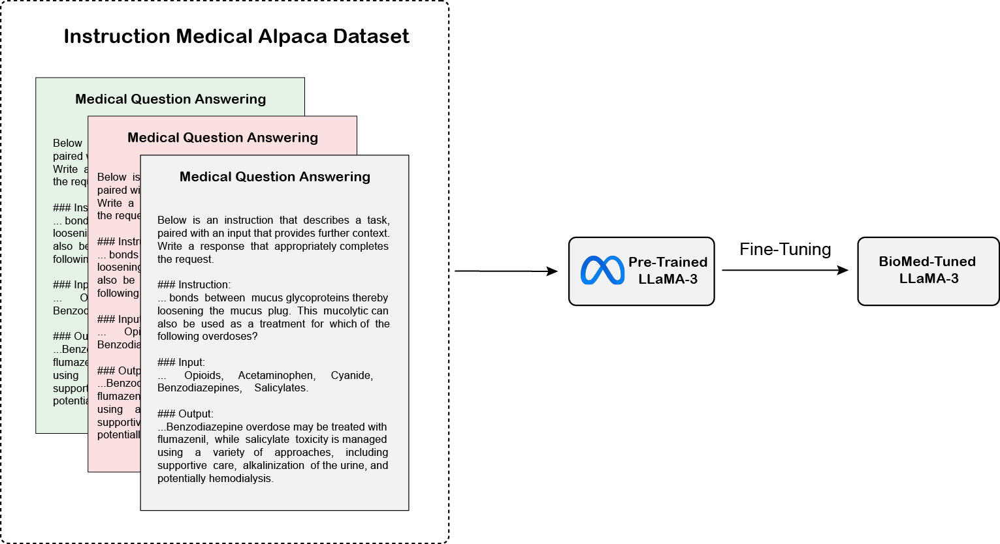
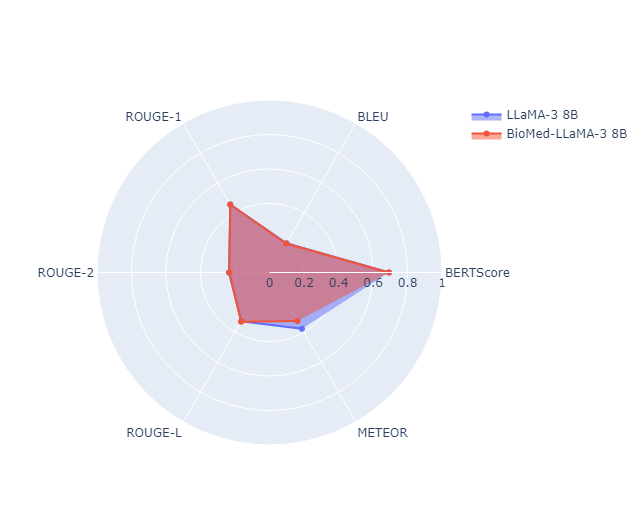
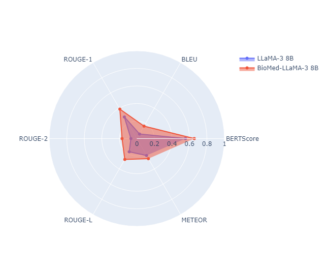

<h1 align="center">BioMed-LLaMa-3: Instruction-Efficient Fine-Tuning of Large Language Models for Improved Biomedical Language Understanding</h1>

<div align='center'>
    <a href='https://github.com/cleardusk' target='_blank'><strong>Nour Eddine Zekaoui</strong></a><sup> 1†</sup>&emsp;
    <a href='https://github.com/Mystery099' target='_blank'><strong>Mounia Mikram</strong></a><sup> 1</sup>&emsp;
    <a href='https://github.com/KwaiVGI' target='_blank'><strong>Maryem Rhanoui</strong></a><sup> 1,2</sup>&emsp;
    <a href='https://github.com/zzzweakman' target='_blank'><strong>Siham Yousfi</strong></a><sup> 1</sup>&emsp;
</div>


<div align='center'>
    <sup>1 </sup>School of Information Sciences, Rabat, Morocco&emsp; <sup>2 </sup>University of Lyon, Lyon, France&emsp;
</div>
<div align='center'>
    <small><sup>†</sup> Corresponding author</small>
</div>
<br>

<div align="center">
  <!-- <a href='LICENSE'></a> -->
  <a href='https://www.springer.com/'></a>
  <!-- <a href='https://liveportrait.github.io'></a> -->
  <a href='https://huggingface.co/spaces/NouRed/BioMed-LLaMa-3'></a>
  <a href="https://github.com/zekaouinoureddine/BioMed-LLaMa-3"></a>
  <br>
</div>
<br>


<p align="center">
  <!--  -->
  <br>
  🔥 For a demo, visit our <a href="https://huggingface.co/spaces/NouRed/BioMed-LLaMa-3"><strong>HF Spaces</strong></a> 🔥
</p>


## Installation

```
git clone https://github.com/zekaouinoureddine/BioMed-LLaMa-3.git
```
## Dataset
<center>
    <div style="width: 80%; text-align: center;">
        
        <p><strong>Figure 1:</strong> BioMed-LLaMA-3 vs. LLaMA-3 results on Med Alpaca Dataset.</p>
</div>
</center>

## Results

| **Dataset**   | **Model**           | **BLEU**  | **ROUGE-1** | **ROUGE-2** | **ROUGE-L** | **BERTScore** | **METEOR** |
|---------------|---------------------|-----------|-------------|-------------|-------------|---------------|------------|
| **MedAlpaca** | LLaMA-3 8B          | **0.196** | 0.455       | **0.235**   | 0.327       | **0.693**     | **0.376**  |
|               | BioMed LLaMA-3 8B   | 0.194     | 0.455       | 0.233       | **0.329**   | 0.692         | 0.325      |
| **ChatDoctor**| LLaMA-3 8B          | 0.061     | 0.285       | 0.068       | 0.174       | 0.555         | 0.222      |
|               | BioMed LLaMA-3 8B   | **0.164** | **0.388**   | **0.169**   | **0.275**   | **0.656**     | **0.264**  |

*Table 1: Results of BioMed-LLaMA-3 and Meta's LLaMA-3 on MedAlpaca and ChatDoctor Medical QA Datasets.*


|  |  |
|:--:|:--:|
| **Figure 1:** BioMed-LLaMA-3 vs. LLaMA-3 results on Med Alpaca Dataset. | **Figure 2:** BioMed-LLaMA-3 vs. LLaMA-3 results on ChatDoctor Dataset. |


## License

## Citation
If you find BioMed-LLaMa-3 useful for your research, welcome to 🌟 this repo and cite our work using the following BibTeX:
```bibtex
@inproceedings{guo2024liveportrait,
  title   = {BioMed-LLaMa-3: Instruction-Efficient Fine-Tuning of Large Language Models for Improved Biomedical Language Understanding},
  author  = {Nour Eddine, Zekaoui and Mounia, Mikram and Maryem, Rhanoui and Siham, Yousfi},
  journal = {},
  year    = {}
}
```

## Contact
* [**Nour Eddine Zekaoui**](https://x.com/NZekaoui); **nour-eddine.zekaoui@esi.ac.ma**
